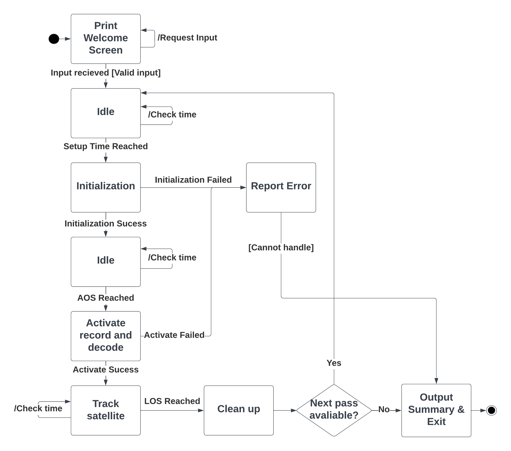

# AGSC (Amateur Ground Station Control)

## About
AGSC is a command line utility to automate the tracking, recording, demodulation, and storage of data from satellites 
operating in the 70cm and 2m amateur radio bands.

### Features
- Satellite pass prediction using [Predict4Java](https://github.com/davidmoten/predict4java)
- Transceiver and rotator control
- Live data demodulation with the [Dire Wolf](https://github.com/wb2osz/direwolf) packet radio modem
- Transmission recorded directly from transceiver
- Operation customizable via configuration files
- Ability to specify non-uniform rotator alignment issues in azimuth
- Organized data storage

AGSC currently supports the following transceiver and rotator models. The rotator or transceiver can be disabled by using
`StubRotator` or `StubTransceiver` models.

#### Transceivers
- ICOM IC-9100 (Similar ICOM models likely supported)

#### Rotators
- Yaesu rotators compatible with the GS-232B computer controller

## Setup
### Build JAR from source
This project is configured to be built using maven.

`mvn clean package`

This will create a `target` directory and with `agsc-*-jar-with-dependencies.jar`. A batch file [agsc.bat](agsc.bat) is provided in the 
root directory to run the JAR, or it can be executed directly using `java.exe` using the following:

`java -jar target/agsc-*-jar-with-dependencies.jar`

### Configure Dependencies

OpenJDK 21.0.1 is recommended.

Most of the dependencies are included in the JAR file, except for the [Dire Wolf](https://github.com/wb2osz/direwolf) 
packet radio modem which must be installed manually. The path to the Dire Wolf executable must be specified in 
[config.properties](./config/config.properties).

## Usage
Before use, verify the settings in the configuration files listed below. The program operates according to the following
flow chart.


## Example Configuration Files
[config.properties](./config/config.properties) contains general settings for the program including
paths to other configuration files, instrument models, and satellite frequency/baud.

Model parameters can accept the following values. Stub models print a message to the log indicating what action would
have been taken if using the non-stub models. Provided to allow testing without the instruments connected.

| Parameter             | Accepted Values                           |
| --------------------- |-------------------------------------------|
| ROTATOR_MODEL         | - RotatorGS232B<br>- StubRotator          |
| TRANSCEIVER_MODEL     | - TransceiverIC9100<br>- StubTransceiver  |
| DECODER_MODEL         | - DireWolf                                |
| RECORDER_MODEL        | - JavaxSoundSampled                       |
| SATELLITE_TRACK_MODEL | - Predict4Java                            |


```
# Log settings
LOG_PATH = .\\logs\\
LOG_LEVEL = DEBUG

# Ground station settings
GS_CALL = MYCALL
GS_LAT = 44.23
GS_LON = -76.48
GS_ELE = 95

# Satellite settings
TLE_PATH = .\\config\\tle.txt
SAT_DL_FREQ_HZ = 435310000
SAT_BAUD = 1200

# Rotator settings
ROTATOR_MODEL = RotatorGS232B
ROTATOR_COM_PORT = COM4
ROTATOR_BAUD = 2400
ROTATOR_CALIBRATION_PATH = .\\config\\rotatorCalibration.txt

# Transceiver settings
TRANSCEIVER_MODEL = TransceiverIC9100
TRANSCEIVER_COM_PORT = COM5
TRANSCEIVER_BAUD = 19200
TRANSCEIVER_ADDRESS = 7C

# Decoder settings
DECODER_MODEL = DireWolf
DECODER_PATH = C:\\Direwolf\\Direwolf-Executable\\direwolf-1.7.0-9807304_i686

# Audio record settings
RECORDER_MODEL = JavaxSoundSampled
RECORDER_SAMPLE_RATE = 48000

# Satellite tracker settings
SATELLITE_TRACK_MODEL = Predict4Java
```


[tle.txt](./config/tle.txt) contains the two-line element set for the satellite of interest.
```
NAME
1 53951U 22057BC  24103.34222925  .00048222  00000-0  10764-2 0  9996
2 53951  97.5617 230.1176 0004425 356.7326   3.3891 15.43389399104594
```


[rotatorCalibration.txt](./config/rotatorCalibration.txt) allows specification of any systematic errors in
rotators azimuthal direction. This file must contain exactly 360 lines with one integer
value on each line. The value on the line is the direction the rotator controller reports
on its readout when the antennas main lobe is pointed towards the angle defined by
the line number, indexed from zero.
```
0
1
2
3
4
5
...
354
355
356
357
358
359
```

## License
AGSC is available under the [GPLv3](LICENSE) free software license.
